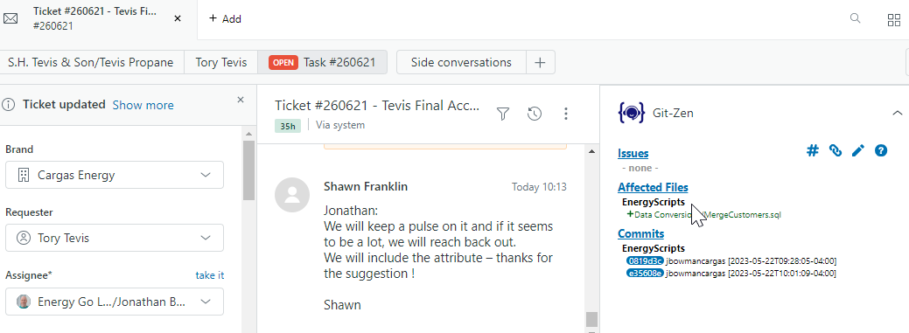

Git/EnergyScripts Lunch and Learn <!-- .element: class="r-fit-text" -->

 <!-- .element: class="hero" -->

Notes:

Welcome. I am Jonathan Bowman. I enjoy collaboration, sharing, and code re-use, and I am hoping you might as well, because those are the very things we are talking about today.

---

## Itinerary

- A git metaphor
- Unsolicited opinions
- Standard git operations in VS Code
- Process for submitting PR to new EnergyScripts repo
- Discussion

---

## gittalk.bowmanjd.com

 <!-- .element: class="hero" -->

---

## Two git repos:

- github.com/Cargas/playground <!-- .element: class="fragment" -->
  - a temporary sandbox repo for experimentation today <!-- .element: class="fragment" -->
- github.com/Cargas/EnergyScripts <!-- .element: class="fragment" -->
  - a script repository that Energy is beginning to use for code sharing and re-use <!-- .element: class="fragment" -->

Notes:

We have two repositories to play with today. The first is for everyone. With the second, we wanted to showcase a particular new thing that Energy is launching internally for code sharing.

|||

## Scavenger Hunt

- github.com/Cargas/playground 
- Fork it
- Add your name and a comment to the README
- Add a file or two that seem relevant
- Create a pull request
- Comment on a pull request

Notes:

- For those of you who like to get hands on, here is a little scavenger hunt you can do, either now or as we engage these concepts in the course of this presentation.

---

<!-- .slide: data-background-image="assets/Staging.jpg"  -->

“Staging” and other overwrought metaphors <!-- .element: class="darktext r-stretch" -->

Notes:

Have you ever heard of "home staging"?

|||

<!-- .slide: data-background-image="assets/empty-dining-room.jpg"  -->

Staging: setting the stage for what will be  <!-- .element: class="darktext r-stretch" -->

|||

<!-- .slide: data-background-image="assets/dining-room.jpg"  -->

In software, we have “staging” and more  <!-- .element: class="darktext" -->

1. We stage files and changes <!-- .element: class="fragment darktext" -->
2. We “commit” those changes to the “product” <!-- .element: class="fragment darktext" -->
3. Rinse and repeat <!-- .element: class="fragment darktext" --> <span class="fragment darktext">(and revise!)</span>

&nbsp;   <!-- .element: class="darktext r-stretch" -->

|||

## Imagine you are a stager

- moving couches, tables, napkins, lamps... (writing code) <!-- .element: class="fragment" -->
- Deciding when the furniture is where you want it (staging) <!-- .element: class="fragment" -->
- Taking a snapshot when you have various pieces where you want them (committing) <!-- .element: class="fragment" -->
- Sharing that snapshot with the team (and possibly customer) <!-- .element: class="fragment" -->
- Deciding together that the room really should look like one of the snapshots (deployment) <!-- .element: class="fragment" -->

|||

## The difficulties

- collaboration is a communication nightmare <!-- .element: class="fragment" -->
- Remembering and redoing are tedious <!-- .element: class="fragment" -->
- sharing and responsibility aren’t always easy (who did what and why?) <!-- .element: class="fragment" -->

|||

## Take staging to the next level

<span class="fragment">With a robot</span> <span class="fragment">and a camera</span>


Named git <!-- .element: class="fragment" -->

Notes:

If you ask git to take a snapshot, it does, and memorizes it for later redo. It can also look at two snapshots and compare them, even combine them. This is the power of this robot with a camera.

|||

# With git you can...

- stage your stuff
- Take <span class="fragment">(commit)</span> snapshots
- review snapshots (communication)
- restore snapshots (rewind)
- share snapshots with others who can even revise them

|||

End of overwrought metaphor <!-- .element: class="r-fit-text" -->

---

 <!-- .element: class="hero" -->

Notes:

Let's do a simple demo of using git with VS Code. But first, I am going to abuse the privilege of having a captive audience...

|||

Consider the command line...

Note:

I am a huge fan of the power, flexibility, and repeatability of the command line (whether Bash or Powershell or something hipper, doesn't matter). But I don't ever want to push anyone into it. But I will suggest that the one tool that might make the command line worth exploring for anyone in this room, is git.

|||

`<del>Disparaging voices in head</del>`

<del>Disparaging voices in head</del>

|||

 <!-- .element: class="hero" -->

|||

We write words that make computers do stuff

|||

```
git clone git@github.com:Cargas/playground.git
git pull
echo something >> README.md
git add .
git commit -m "I added something"
git push
```

---

 <!-- .element: class="hero" -->

Notes:

Just like Email is not the same as Outlook, and the Web is not the same as Google, git is not the same as GitHub. But GitHub wouldn't exist without git, and GitHub has certainly contributed to git's popularity. GitHub is a great place to mess around with Git on your own, but not the only place. All you need is a folder, could be local only, or could be in the cloud. More importantly, there are a ton of somewhat intimidating features in GitHub that are awesome but not required to simply use git. Back to VS Code.

---

 <!-- .element: class="hero" -->

|||

 <!-- .element: class="hero" -->

Notes:

Source Control is the view you will frequently use in VS Code. Marked by this source control symbol.

|||

## VS Code extensions for git

- [GitHub Pull Requests and Issues](https://marketplace.visualstudio.com/items?itemName=GitHub.vscode-pull-request-github)
- [GitLens](https://marketplace.visualstudio.com/items?itemName=eamodio.gitlens)
- [GitHub Repositories](https://marketplace.visualstudio.com/items?itemName=github.remotehub)

What git-related extensions do you recommend?

Notes:

Here are three VS Code extensions I recommend for using git.

|||

<!-- .slide: data-background-video="assets/vscode-extensions.mp4" data-background-video-loop="true" data-background-size="contain" data-background-video-muted="true" -->

|||

It all starts with `F1` <span class="fragment">(or `ctrl-shift-p`)</span>


Notes:

All git commands can be found in the command palette. Type "git" to find them.

|||

## Or the Source Control View


Notes:

Use "Clone Repository" to check out something you don't have already.

|||


Notes:

The shish kebaab (three dot) menu is another source of git commands.

|||

## git clone <!-- .element: class="fragment fade-out" -->

<!-- .slide: data-background-video="assets/vscode-clone.mp4" data-background-video-loop="true" data-background-size="contain" data-background-video-muted="true" -->

|||

## git pull <!-- .element: class="fragment fade-out" -->

<!-- .slide: data-background-video="assets/vscode-pull.mp4" data-background-video-loop="true" data-background-size="contain" data-background-video-muted="true" -->

|||

## Stage changes (git add) <!-- .element: class="fragment fade-out" -->

<!-- .slide: data-background-video="assets/vscode-add.mp4" data-background-video-loop="true" data-background-size="contain" data-background-video-muted="true" -->

|||

## git commit <!-- .element: class="fragment fade-out" -->

<!-- .slide: data-background-video="assets/vscode-commit.mp4" data-background-video-loop="true" data-background-size="contain" data-background-video-muted="true" -->

---

## Commit messages

- Commit messages should be
  - descriptive
  - long enough but not too long
  - unique, specific

|||

## Git-Zen

- Add Zendesk ticket number to git commit message, prefixed with `gz#`
- Such as "gz#1234567"
- That ticket will now keep a link to the code in GitHub
- Currently only integrated with EnergyScripts repo, but others can be added

|||



---

THE FOLLOWING IS A PUBLIC SERVICE ANNOUNCEMENT

Notes:

- going to poke the bear on the last one. Here goes...

|||

Keep your lines short

|||

## This is a merge conflict waiting to happen

<code>SELECT bEntity, Name, FirstName FROM bEntity WHERE bEntityID = 123456 AND bDivisionID = 2</code>

Notes:

89 characters long, but that isn't the point. Should be 91 chars, note the error in the field name. What if someone other than me, or another branch of me, fixes this?

|||

## In contrast, git will handle corrections/additions to this gracefully

```sql
SELECT 
  bEntity,
  Name, 
  FirstName
  FROM bEntity
  WHERE bEntityID = 123456
  AND bDivisionID = 2
```

---

EnergyScripts <!-- .element: class="r-fit-text fragment fade-out" -->

<!-- .slide: data-background-video="assets/vscode-clone-energyscripts.mp4" data-background-video-loop="true" data-background-size="contain" data-background-video-muted="true" -->

Notes:

In Energy, we desire a familiar place where we can store code for reference and re-use, and collaborate on it there. So a new repo, EnergyScripts has come to be.

|||

Articles related to EnergyScripts

- [Guide: Using VS Code to Contribute to the EnergyScripts GitHub Repository](https://cargasenergyinternal.cargasenergy.com/hc/en-us/articles/15894754096013)
- [Checking a Script Into the EnergyScripts Repo - From Start to Finish](https://cargasenergyinternal.cargasenergy.com/hc/en-us/articles/14919373604493)

Note:

The first link is the umbrella article that includes links to many others.

|||

## Start with an internal Zendesk Knowledgebase article


Notes:

- Stop short of publishing your article
- Leave script blank for now

|||

Navigate in VS Code to the EnergyScripts repo

(Clone it if you have not yet)

|||

Find a folder relevant to your script


or create one

|||

## Use Zendesk Knowledgebase categories as folder name


|||

## Create file


|||

## Place an informative header at the top of the file

- Start typing `header` and then auto-complete using the installed code snippet


|||

## Add code and save, but do not stage yet

```sql
/*********************** header **********************************************
** Title: De-duplicate Customers
** Description:	Merge a set of customers
** Created By: Jonathan Bowman
** Created Date: 2023-05-01
** KB Article: Merge/de-duplicate a set of customers
** KB URL: [https://cargasenergyinternal.cargasenergy.com/hc/en-us/articles/14919373604493]
******************************************************************************/

USE ConversionScripts;

SET ANSI_NULLS ON;
SET QUOTED_IDENTIFIER ON;
GO

CREATE OR ALTER PROCEDURE dbo.Merge_If_You_Dare
AS
```

|||

## Submit a PR for the file in question

---

The Pull Request <!-- .element: class="r-fit-text" --> 

(PR) <!-- .element: class="fragment" --> 

Notes:

Let's talk briefly about pull requests and what they are. A PR is the cleverest GitHub innovation.

|||

## Pull Request (PR)

- literally, a request to pull your changes into the main development branch
- a way to communicate you have suggested changes <!-- .element: class="fragment" -->
- a public forum in which to review, discuss, and revise those changes <!-- .element: class="fragment" -->

|||

 <!-- .element: class="hero" -->

Notes:

Branching is a way you can, in the same repository, create a fork (a copy) of the repo, and continue to iterate on it.

|||

<!-- .slide: data-background-video="assets/vscode-pull-request.mp4" data-background-video-loop="true" data-background-size="contain" data-background-video-muted="true" -->

Notes:
1. Create branch, name it appropriately
2. Note that you are now on that branch
3. Stage the file
4. Write a commit message, with the git-zen link if there is a ticket
5. Commit & Create Pull Request
6. Create
7. You will be prompted to publish the new branch on the remote if you didn't already
8. Finally, grab the link (the #24 at the end of the demo)

|||

## Others can review pull requests on GitHub


|||

## Reviews and revisions are _part of the process_


|||

## In VS Code, once approved, merge


Notes:

Note the recommended squash and merge.

---

Playground contributions <!-- .element: class="r-fit-text" -->

---

Discuss <!-- .element: class="r-fit-text" -->

---

Thank you <!-- .element: class="r-fit-text" -->

Notes:

Thank you. Questions? Opinions? Good arguments we can have with one another?
